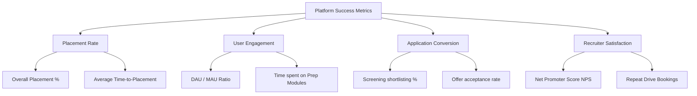

# Section 3: Product Requirement Document (PRD)

**Document Version:** 1.0.0  
**Author:** Lead Product Manager  
**Date:** June 3, 2026  
**Status:** Approved / Ready for Engineering  

---

## 1. Executive Summary
The **AI-Powered Placement Management Platform (AIPMP)** is a centralized, cloud-native enterprise SaaS application designed to replace outdated manual systems (spreadsheets, emails, paper documents) within university placement cells. By layering Natural Language Processing (NLP) and recommendation engines over clean data models, the platform increases placement cell efficiency by 80%, boosts student selection ratios by 35%, and shortens recruiter hiring cycles from weeks to days.

---

## 2. Problem Statement
The current university career services landscape is bottlenecked by manual, error-prone workflows:
1.  **Administrative Exhaustion:** Placement Officers spend 60% of their time verifying student profiles, chasing resume uploads, and formatting Excel sheets.
2.  **Information Asymmetry:** Students struggle to find jobs matching their exact skills, resulting in spray-and-pray applications.
3.  **Recruitment Inefficiency:** Corporate recruiters spend days parsing through resumes that lack standardized formats, leading to poor selection accuracy and prolonged timelines.
4.  **Lack of Real-Time Analytics:** College administrators cannot track placement rates or pipeline yield rates dynamically, making accreditation audits slow and costly.

---

## 3. Business Goals & Product Vision

### Product Vision
To establish the industry-standard career transition ecosystem for universities that uses AI to connect the right candidate with the right employer, transforming college placement cells from cost centers into high-efficiency talent engines.

### Business Goals
*   **100% Digitalization:** Transition 100% of campus placement activities (drives, records, schedules) away from physical/Excel records within 3 months of launch.
*   **Time-to-Hire Reduction:** Cut average recruiter screen-to-offer duration by 50%.
*   **Increase Average CTC:** Improve student selection rate for premium tier jobs (packages > $100K/year) by 25% through precision matching.
*   **Accreditation Efficiency:** Reduce NIRF/NAAC placement audit compilation time from 3 weeks to 1 click.

---

## 4. Target Audience & Market Opportunity

### Target Audience
*   **Higher Education Institutions:** Tier-1 and Tier-2 engineering, management, and arts colleges.
*   **Corporate Hiring Managers & HR Teams:** Tech giants, consulting firms, startups, and mid-sized enterprises.
*   **Undergraduate & Postgraduate Students:** Job-seeking college students in their final years.

### Market Opportunity
Higher education institutions spend millions annually on student career services and accreditation audits. The globally expanding EdTech and HR Tech markets are converging on institutional outcome platforms. AIPMP captures this by providing a unified portal that offers immediate, measurable ROI for college directors, recruiters, and students.

---

## 5. Functional Requirements

### Feature Grouping by User Type

### 🎓 5.1. Student Features

| ID | Feature Name | Description | User Impact |
| :--- | :--- | :--- | :--- |
| **ST-01** | Registration/Login | Passwordless magic-link sign-up and university SSO (Single Sign-On). | Easy onboarding. |
| **ST-02** | Profile Management | Dynamic, verified student profile showing GPAs, backlogs, projects, and certifications. | Single source of truth. |
| **ST-03** | Resume Upload | Drag-and-drop resume upload (PDF/DOCX) with version management. | Centralized asset store. |
| **ST-04** | AI Resume Analysis | Deep analysis of resume text with scoring, grammar checks, and skill-gap reports. | Direct profile optimization. |
| **ST-05** | Job Recommendations | Algorithmic feed ranking active company job listings matching student profiles. | Focuses attention on best fits. |
| **ST-06** | Application Tracking | Dashboard mapping status of applied drives (Applied -> Test -> Interview -> Offer/Reject). | Eliminates anxiety. |
| **ST-07** | Interview Preparation | Dynamic prompt builder giving personalized mock questions based on profile. | Improves confidence. |

### 🏢 5.2. Recruiter Features

| ID | Feature Name | Description | User Impact |
| :--- | :--- | :--- | :--- |
| **RC-01** | Job Posting | Screen to input JD text, compensation, branch limits, and automatic eligibility thresholds. | Sets boundaries for applicants. |
| **RC-02** | Candidate Search | Query interface to filter student profiles by skills, graduation year, and GPA. | Immediate sourcing. |
| **RC-03** | AI Candidate Ranking | Automatic stack-ranking of applicant pool based on semantic job description mapping. | Eliminates manual screening. |
| **RC-04** | Interview Scheduling | Built-in calendar grid to input available hours and auto-assign candidates. | Saves hours of coordination. |
| **RC-05** | Hiring Dashboard | Funnel tracker showing applicants, test-cleared, interviewed, and offered candidates. | Real-time recruitment ROI. |

### 👔 5.3. Placement Officer Features

| ID | Feature Name | Description | User Impact |
| :--- | :--- | :--- | :--- |
| **PO-01** | Drive Management | Launch and monitor drives, coordinate visiting calendars, and publish deadlines. | Full drive management. |
| **PO-02** | Eligibility Management | Set and lock academic criteria database (CGPA, active backlogs, branches). | Automated rule enforcement. |
| **PO-03** | Analytics Dashboard | Real-time graphs on placement rates, department-wise stats, and packages. | Quick management reporting. |
| **PO-04** | Student Tracking | Filter student directories by placement status to target unplaced cohorts. | Ensures no student is left behind. |

### 🔑 5.4. Admin Features

| ID | Feature Name | Description | User Impact |
| :--- | :--- | :--- | :--- |
| **AD-01** | User Management | Admin directory to approve recruiters, suspend users, and re-assign system roles. | Platform governance. |
| **AD-02** | Platform Analytics | System metrics covering parser queues, API counts, and active daily sessions. | Performance monitoring. |
| **AD-03** | Reports | Audit logs exporter to track actions, updates, and system data downloads. | Ensures compliance. |

### 🤖 5.5. AI Features

*   **Resume Parsing (NLP Engine):** Leverages Named Entity Recognition (NER) models to extract structured JSON data from raw text/PDF resumes.
*   **Skill Extraction:** Normalizes extracted resume strings into standardized taxonomies (e.g. mapping "ReactJS", "React.js", "React" to a single skill node: `react`).
*   **Candidate Matching & Ranking Engine:** Calculates a similarity vector score (0.0 to 1.0) between the candidate's normalized skills, project profiles, and the recruiter's Job Description requirements.
*   **Job Recommendation Engine:** Suggests active jobs on student dashboards by cross-referencing candidate vector weights, academic eligibility parameters, and historic hiring trends.
*   **Interview Question Generator:** Uses a lightweight LLM pipeline to process the student's resume and target job requirements, generating customized behavioral and technical interview questions.

---

## 6. Non-Functional Requirements (NFRs)

### 🔒 6.1. Security & Compliance
*   **Authentication:** Multi-factor authentication (MFA) and JWT tokens with 15-minute expiration window.
*   **Data Encryption:** HTTPS (TLS 1.3) for data-in-transit, and AES-256 for data-at-rest (MongoDB storage).
*   **Role-Based Access Control (RBAC):** Strict database middleware validations preventing a student role from accessing admin or recruiter endpoints.

### 📈 6.2. Scalability
*   **Horizontal Scalability:** Microservices design allowing independent scaling of the AI Parsing service and main API server.
*   **Database Partitioning:** MongoDB indexing on high-search fields (`CGPA`, `Skills`, `PlacementStatus`).

### ⚡ 6.3. Performance
*   **Page Load Time:** First Contentful Paint (FCP) must occur under 1.5 seconds.
*   **API Response Time:** 95% of standard CRUD API responses must return in under 300ms.
*   **AI Processing Latency:** Resume parsing must finish in less than 5 seconds.

### 🟢 6.4. Availability
*   **Uptime SLA:** 99.9% availability during active placement cycles (September - May).
*   **Disaster Recovery:** Automated hourly db backups with a multi-region failover configuration.

### 🛡️ 6.5. Reliability
*   **Fault Tolerance:** Retry mechanisms for third-party calendar/mail API failures.
*   **Maximum Failure Rate:** Error rate for user requests must remain below 0.1%.

---

## 7. Success Metrics (KPIs)

To evaluate the platform's performance post-release, the following metrics will be tracked:

1.  **Placement Rate:** 
    *   *Metric:* Percentage of registered students placed by graduation date.
    *   *Target:* > 95% overall placement rate.
2.  **User Engagement:**
    *   *Metric:* Daily Active Users (DAU) to Monthly Active Users (MAU) ratio.
    *   *Target:* > 60% DAU/MAU for students during placement season.
3.  **Application Conversion Rate:**
    *   *Metric:* Number of applicants shortlisted by recruiters divided by total applicants.
    *   *Target:* > 40% conversion rate (indicating high match accuracy, avoiding spray-and-pray).
4.  **Recruiter Satisfaction:**
    *   *Metric:* Post-drive Net Promoter Score (NPS) surveys completed by corporate HRs.
    *   *Target:* NPS rating above +50.

---

## 8. User Personas & Use Cases

### Primary User Personas

#### Persona 1: Arjun Kumar - Engineering Student (Age 22)
- **Background:** CSE student, GPA 8.7, 6 months until graduation.
- **Motivation:** Wants a placement offer from a top tech company (Tier-1 MNC).
- **Pain Point:** Applies to 20+ companies monthly but receives no feedback on rejections.
- **AIPMP Value:** Gets AI feedback on resume, personalized job matches, and mock interview prep.

#### Persona 2: Priya Sharma - Corporate Recruiter (Age 35)
- **Background:** Senior Talent Acquisition Manager at a Fortune 500 tech firm.
- **Motivation:** Complete a campus drive in 1 day with 30 quality hires.
- **Pain Point:** Manually screens 500 resumes daily; 80% are unqualified.
- **AIPMP Value:** AI-ranked candidate list, smart scheduling, and instant funnel analytics.

#### Persona 3: Dr. Rajesh Patel - Placement Officer (Age 48)
- **Background:** Heads placement cell at a 5,000-student engineering college.
- **Motivation:** Achieve 95%+ placement rate and streamline NAAC audit submission.
- **Pain Point:** Maintains 15 Excel sheets tracking student profiles, company drives, and hiring status.
- **AIPMP Value:** Unified digital platform replacing spreadsheets, automated verification, instant reporting.

### Critical Use Cases

**Use Case 1: Student Resume Submission & AI Analysis**
- Student uploads PDF resume → System parses and extracts skills → AI generates optimization suggestions → Student receives feedback score (e.g., 82/100) with actionable improvements.
- **Business Impact:** Reduces submission errors by 90%; improves match accuracy.

**Use Case 2: Recruiter Candidate Ranking & Scheduling**
- Recruiter posts job with eligibility rules → Candidates apply → AI ranks by semantic match → Recruiter selects top 20 → Smart scheduler auto-books interviews based on availability → System sends calendar invites.
- **Business Impact:** Reduces recruiter screening time from 8 hours to 1.5 hours per drive.

**Use Case 3: Placement Officer Bulk Verification & Reporting**
- Officer uploads university grade export (CSV) → System auto-matches against student profiles → Flags discrepancies → Officer resolves via student confirmation → Locked profiles ready for recruiter viewing.
- **Business Impact:** Reduces manual verification time from 40 hours to 3 hours per semester.

---

## 9. Implementation Constraints & Risks

### Known Constraints
- **Data Quality:** Incoming university registrar data may be incomplete; plan for 15% manual data cleanup.
- **Third-Party Dependency:** Reliance on OpenAI/Cohere APIs for NLP parsing introduces latency and cost variables.
- **Stakeholder Adoption:** Alumni mentors and students may require incentive structures to drive engagement.

### Risk Mitigation Plan

| Risk | Probability | Impact | Mitigation |
| :--- | :--- | :--- | :--- |
| **Poor AI Parser Accuracy** | Medium | High | Build fallback manual profile entry; conduct user testing with 50+ real resumes. |
| **Slow API Latency During Peak Drives** | Medium | High | Implement caching for vector scores; scale API horizontally. |
| **Low Student Engagement** | Medium | Medium | Gamify resume improvements (badges); send push notifications for matches. |
| **Recruiter Churn** | Low | High | Provide dedicated onboarding support; gather weekly NPS feedback. |

---

## 10. Acceptance Criteria for Launch Readiness

Before going live, the platform must meet the following acceptance criteria:

1. ✅ **Core Functionality:** All Must-Have features in Section 4 (Feature Prioritization) deployed and tested.
2. ✅ **Performance:** 95th percentile API response time ≤ 300ms across 500 concurrent user load test.
3. ✅ **Security:** Completed security audit with zero critical vulnerabilities; role-based access verified.
4. ✅ **Data Validation:** Student GPA sync with registrar database shows ≥ 99% match accuracy.
5. ✅ **User Testing:** 50+ users (students, recruiters, officers) completed UAT with ≥ 4/5 satisfaction score.
6. ✅ **Documentation:** System runbook, API documentation, and user manuals finalized.
7. ✅ **Backup & Recovery:** Tested disaster recovery procedures with RTO < 1 hour.

---

## 11. Post-Launch Support & Iteration Plan

- **Weekly Stakeholder Sync:** Monday 10 AM calls with Placement Officer and top 3 recruiters.
- **Monthly Feature Releases:** Lightweight, non-disruptive improvements released the 1st Monday of each month.
- **Quarterly Product Reviews:** Deeper strategic discussions incorporating user feedback and performance metrics.
- **Annual Major Versioning:** Phase 2 and Phase 3 feature additions planned yearly.

---

**Document Approval:**
- **Product Manager:** _________________________ | **Date:** ___________
- **Engineering Lead:** ________________________ | **Date:** ___________
- **Placement Officer Representative:** _______ | **Date:** ___________
