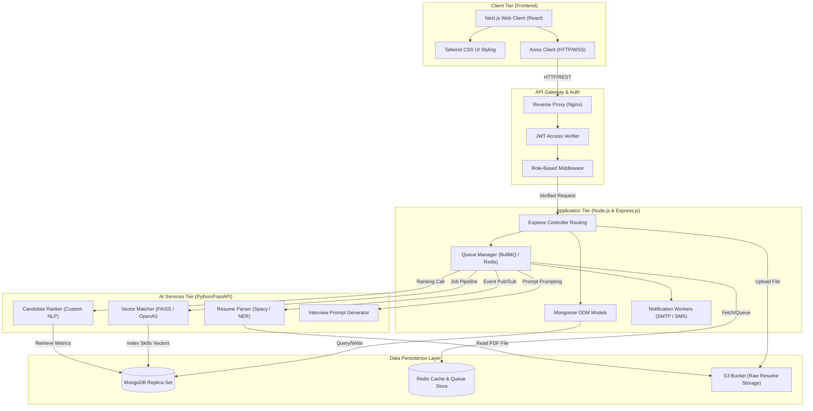

# Section 6: System Architecture Design

This section outlines the high-level system architecture and software design blueprint for the **AI-Powered Placement Management Platform**. The platform is designed using a cloud-native, microservices-oriented architectural model built on a modern MERN stack alongside dedicated Python AI processing layers.

---

## 📐 End-to-End System Architecture

The following block architecture diagram outlines the network layers, request handling pathways, and the boundary separations between clients, gateway, databases, and AI workers.



---

## 🛠️ Technology Stack Breakdown

| Layer | Component | Chosen Technology | Architectural Justification |
| :--- | :--- | :--- | :--- |
| **Frontend** | Framework | **React.js & Next.js 14+** | Single Page Application (SPA) efficiency, Server-Side Rendering (SSR) for SEO-optimized landing pages, and optimized page bundling. |
| | Styling | **Tailwind CSS** | Utility-first component design, fast UI adjustments, responsive layout breakpoints, and clean code compilation. |
| **Backend** | Framework | **Node.js & Express.js** | Event-driven, non-blocking I/O execution loop. Perfect for handling multiple database queries and file streams concurrently. |
| **Auth** | Security | **JWT & Passport.js** | Stateless authentication tokens allow secure API authorization. Role checks are embedded in token headers (RBAC). |
| **Database** | Database | **MongoDB Atlas** | Document store ideal for handling flexible, unstructured resume documents alongside structured academic models. |
| | Caching / Queues | **Redis** | In-memory key-value cache to save expensive match vector results and manage backend queue tasks. |
| **AI Layer** | Framework | **Python & FastAPI** | Python is the industry standard for NLP and machine learning execution. FastAPI provides high-throughput API communication with the Node server. |
| | Parsing | **SpaCy / PyMuPDF** | Performs Named Entity Recognition (NER) to pull sections, education metadata, and skill matches from files. |
| | Similarity | **SentenceTransformers / FAISS**| Converts job descriptions and resumes into high-dimensional embeddings to perform vector-similarity searches. |

---

## 🔐 Authentication & Data Protection Protocol

### JWT Session Management Flow
```text
[Student/Recruiter]             [Next.js Client]            [Express Server]         [MongoDB Database]
         |                              |                           |                         |
         |----- Submit Credentials ---->|                           |                         |
         |                              |----- Hash & Post Login -->|                         |
         |                              |                           |----- Validate User ---->|
         |                              |                           |<---- Return User Record-|
         |                              |<---- Sign JWT Token ------|                         |
         |                              |      (Expires in 15m)     |                         |
         |<---- Redirect to Dash -------|                           |                         |
         |                              |                           |                         |
```

1.  **Transport Security:** Every HTTP/WebSocket API transaction is encapsulated within TLS 1.3 encryption tunnels.
2.  **Role Verification Middleware:** Every admin endpoint checks the parsed JWT payload to confirm `User.role === 'admin'` before database read/write execution.
3.  **Data Isolation:** Multi-tenancy structure separates university registration records from external recruiter contact databases.

---

## 📦 Database Design & Schema Overview

### Core Collections Structure (MongoDB)

```javascript
// Users Collection
db.users = {
    _id: ObjectId,
    email: String,
    passwordHash: String,
    role: Enum["student", "recruiter", "officer", "admin"],
    createdAt: DateTime,
    isVerified: Boolean,
    universityId: ObjectId (reference)
}

// StudentProfiles Collection
db.studentProfiles = {
    _id: ObjectId,
    userId: ObjectId,
    fullName: String,
    cgpa: Number,
    activeBacklogs: Number,
    branch: String,
    graduationYear: Number,
    skills: [String],
    projects: [{title: String, description: String, technologies: [String]}],
    resumes: [{fileUrl: String, uploadDate: DateTime}],
    isVerified: Boolean,
    verifiedBy: ObjectId,
    placementStatus: Enum["unplaced", "processing", "placed", "hold"],
    placedIn: {company: String, ctc: Number, role: String},
    createdAt: DateTime,
    updatedAt: DateTime
}

// JobPostings Collection
db.jobPostings = {
    _id: ObjectId,
    companyName: String,
    jobTitle: String,
    jobDescription: String,
    requiredSkills: [String],
    minCGPA: Number,
    maxBacklogs: Number,
    eligibleBranches: [String],
    salary: {min: Number, max: Number},
    location: String,
    deadline: DateTime,
    createdBy: ObjectId,
    status: Enum["draft", "approved", "active", "closed"],
    applications: {
        totalCount: Number,
        screened: Number,
        interviewed: Number,
        offered: Number
    },
    createdAt: DateTime
}

// Applications Collection
db.applications = {
    _id: ObjectId,
    studentId: ObjectId,
    jobPostingId: ObjectId,
    status: Enum["applied", "shortlisted", "test_pending", "interview_scheduled", "offered", "rejected"],
    resumeScore: Number,
    aiMatchPercentage: Number,
    appliedAt: DateTime,
    screenedAt: DateTime,
    testScore: Number,
    interviewNotes: String,
    offerStatus: Enum["pending", "accepted", "declined"]
}
```

### Indexing Strategy

```javascript
// High-Priority Indexes for Query Performance
db.studentProfiles.createIndex({ cgpa: 1 });
db.studentProfiles.createIndex({ skills: 1 });
db.studentProfiles.createIndex({ placementStatus: 1 });
db.jobPostings.createIndex({ status: 1, deadline: 1 });
db.applications.createIndex({ studentId: 1, jobPostingId: 1 });
db.applications.createIndex({ status: 1 });
db.applications.createIndex({ aiMatchPercentage: -1 });
```

---

## 🚀 Deployment Architecture

### Cloud Infrastructure Setup (AWS/GCP)

```text
┌─────────────────────────────────────────────────────────────────┐
│                        CDN Layer (CloudFront)                    │
│                   Caches static assets globally                  │
└────────────────────────┬────────────────────────────────────────┘
                         │
┌────────────────────────▼────────────────────────────────────────┐
│              Application Load Balancer (ALB)                     │
│          Routes traffic to container instances                  │
└────────────────────────┬────────────────────────────────────────┘
                         │
        ┌────────────────┼────────────────┐
        │                │                │
┌───────▼────────┐ ┌─────▼─────────┐ ┌──▼──────────────┐
│  Next.js App   │ │ Express API   │ │ Python FastAPI  │
│  (ECS Fargate) │ │ (ECS Fargate) │ │ (ECS Fargate)   │
│  3 Instances   │ │  5 Instances  │ │  3 Instances    │
└────────────────┘ └───────────────┘ └─────────────────┘
                         │
        ┌────────────────┼────────────────┐
        │                │                │
┌───────▼────────┐ ┌─────▼─────────┐ ┌──▼──────────────┐
│  MongoDB Atlas │ │   Redis Cache │ │  S3 Bucket      │
│  Replica Set   │ │  (ElastiCache)│ │  (File Storage) │
└────────────────┘ └───────────────┘ └─────────────────┘
```

### Containerization & CI/CD Pipeline

- **Docker Images:** Each service (Next.js, Express, FastAPI) runs as a separate Docker container
- **ECR Registry:** Images stored in AWS Elastic Container Registry
- **GitHub Actions:** Automated testing and deployment on git push
- **Blue-Green Deployment:** Zero-downtime updates via rolling instance swaps

---

## 🔄 API Endpoint Overview

### Core REST API Endpoints

```
Auth Endpoints:
POST   /api/auth/register           # User registration
POST   /api/auth/login              # User login with email & password
POST   /api/auth/logout             # Invalidate JWT token
GET    /api/auth/profile            # Get logged-in user profile

Student Profile Endpoints:
GET    /api/students/profile        # Fetch student profile
PUT    /api/students/profile        # Update student profile
POST   /api/students/resume/upload  # Upload resume file
GET    /api/students/resume/parse   # Trigger AI resume parsing

Job Posting Endpoints:
GET    /api/jobs                    # List all active job postings
GET    /api/jobs/:id                # Get specific job details
POST   /api/jobs (recruiter only)   # Create new job posting
PUT    /api/jobs/:id (recruiter)    # Update job posting

Application Endpoints:
POST   /api/applications             # Submit application for job
GET    /api/applications             # List student's applications
GET    /api/jobs/:id/applications    # List applicants for a job (recruiter)
PUT    /api/applications/:id/status  # Update application status

Admin Endpoints:
GET    /api/admin/analytics         # Platform analytics dashboard
GET    /api/admin/users             # List all users
PUT    /api/admin/users/:id/role    # Update user role
```

---

## 💾 Backup & Disaster Recovery Plan

- **MongoDB Backups:** Automated daily snapshots with 30-day retention
- **Cross-Region Replication:** Real-time replication to backup region
- **RTO (Recovery Time Objective):** < 1 hour
- **RPO (Recovery Point Objective):** < 15 minutes
- **Disaster Recovery Drill:** Quarterly failover tests to ensure readiness
