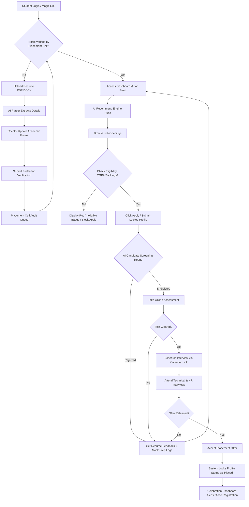
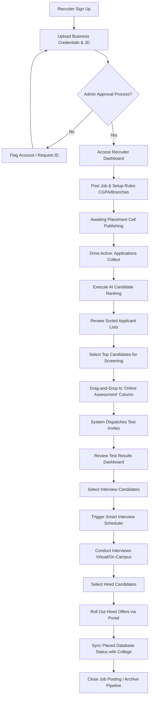
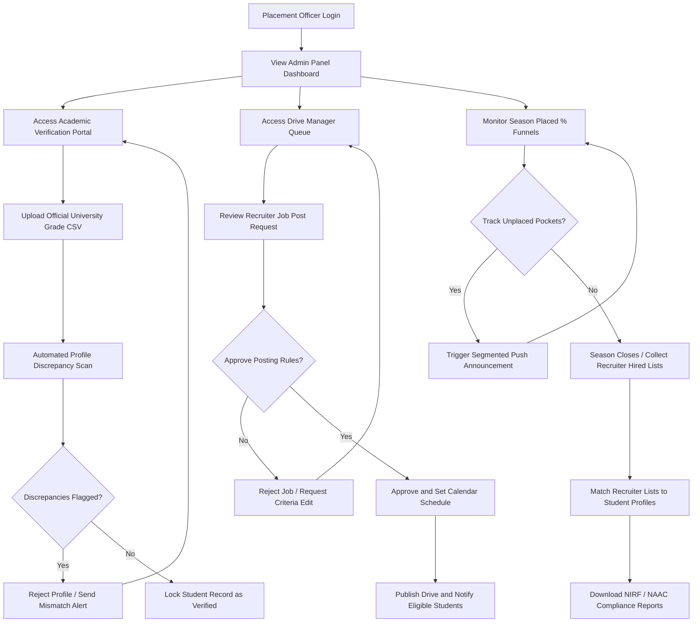

# Section 7: User Flow Diagrams

This section outlines the operational user flows for the three primary system roles. Each flowchart maps out the decision points, system processes, and notifications from authentication through to successful placement.

---

## 🎓 1. Student Journey Flow

The student workflow tracks candidate progression from registration through AI enhancement, eligibility screens, testing, interviewing, and final hire lock.

---

## 🏢 2. Recruiter Journey Flow

The recruiter flow spans account setup, job configuration, applicant processing via AI ranking, screening, interview orchestration, and closing out the offer sheets.

---

## 👔 3. Placement Officer Journey Flow

The Placement Officer's flow focuses on platform administration, drive orchestration, bulk academic auditing, and generating reports.

