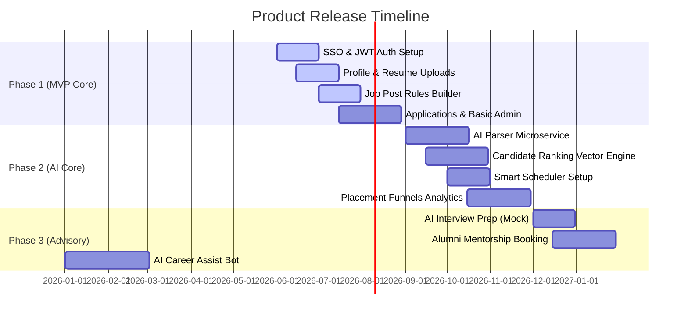

# Section 8: Product Roadmap & Milestones

This section maps out the multi-phase release plan for the **AI-Powered Placement Management Platform**. The roadmap balances foundational data workflows with advanced AI integrations to ensure continuous feedback loops and stable scaling.

---

## 📅 Roadmap Visual Timeline

The Gantt chart below schedules the parallel and sequential execution of feature tracks across three major development phases spanning 9 months.

---

## 🏁 Phase Details & Exit Criteria

### 📦 Phase 1: Foundational MVP (Months 1–3)
*   **Goal:** Replace physical paper and spreadsheet management with a highly reliable web transaction loop.
*   **Features:**
    *   Secure Role-based JWT login & University SSO integration.
    *   Student Profile builder (locked fields for GPA & Backlogs) and PDF/DOCX resume file upload.
    *   Job posting board for recruiters with automated eligibility logic gates.
    *   Student application list, basic status updates (Applied/Hired/Rejected).
    *   Manual student verification panel for Placement Officers.
*   **Key Milestone:** *Successful pilot drive completed for 1 corporate partner with 500+ student applicants.*
*   **Phase Exit Criteria:**
    *   System uptime metrics > 99.9% on staging servers.
    *   Data entry error rate (profile save fails) < 0.1%.
    *   100% of student profile GPAs match official registrar database inputs.

---

### 🧠 Phase 2: AI Enhancements & Analytics (Months 4–6)
*   **Goal:** Apply automation to candidate screening and data visualization.
*   **Features:**
    *   AI Resume Parsing Microservice (converting raw text files into structured profiles).
    *   Semantic Candidate Matching and Vector-based Job Recommendations.
    *   Recruiter Pipeline Dashboard featuring drag-and-drop Kanban state controls.
    *   Smart Calendar Sync for automated interview scheduling.
    *   Real-time analytical graphs mapping placement rates, salary ranges, and department metrics.
*   **Key Milestone:** *80% reduction in average resume screening time for visiting recruiters.*
*   **Phase Exit Criteria:**
    *   AI Parser reaches > 90% parsing accuracy on standard resumes.
    *   API latency for search queries remains under 300ms at 500 concurrent users.
    *   NPS survey rating from corporate recruiters exceeds +40.

---

### 🚀 Phase 3: Advanced Advisory & Career Readiness (Months 7–9)
*   **Goal:** Enhance student placement preparedness and build long-term career support.
*   **Features:**
    *   AI Interview Question Generator (synthesizing custom prep prompts from student resume context).
    *   Alumni Mentorship Portal supporting mock bookings and structured feedback reports.
    *   AI Conversational Career Assistant (guiding students on skill acquisition pathways).
    *   Automated compliance audit report exporter (NIRF/NAAC structured formats).
*   **Key Milestone:** *Launch of integrated career prep modules resulting in a 25% increase in average mock interview scores.*
*   **Phase Exit Criteria:**
    *   More than 70% of active students complete at least 2 mock sessions.
    *   NIRF report downloads format matches state requirements perfectly on validation.
    *   Mentorship portal handles 100+ concurrent video slots successfully.

---

## 📈 Roadmap Milestone Summary Table

| Timeline | Phase | Core Value Proposition | Release Risk / Dependency | Mitigation Strategy |
| :--- | :--- | :--- | :--- | :--- |
| **Q1 (M1-M3)** | **Phase 1 (MVP)** | Process digitization & credential safety. | Incomplete/dirty registrar database sync. | Provide CSV bulk-upload verification fallback. |
| **Q2 (M4-M6)** | **Phase 2 (AI & Data)** | Automation of candidate selection. | High token costs / latency from third-party LLMs. | Cache vector similarity scores; build local embeddings. |
| **Q3 (M7-M9)** | **Phase 3 (Advisory)** | Student readiness and career tracking. | Low alumni engagement / availability. | Incentivize alumni with tier certificates and direct hiring channels. |

---

## 🎯 Phase-Specific Success Metrics

### Phase 1 Success Indicators
- Platform uptime: 99.9%+
- Data sync accuracy (student profiles vs. registrar): 99%+
- User onboarding completion time: < 10 minutes
- Placement Officer task completion time reduced by 60% (verified vs. manual)
- Zero critical security vulnerabilities detected

### Phase 2 Success Indicators
- AI parser accuracy: 90%+
- Average resume screening time reduction: 70% (from 8 hrs to 2.4 hrs per drive)
- Candidate ranking correlation with recruiter feedback: 85%+ alignment
- Application conversion rate improvement: 40%+
- API response times (95th percentile): ≤ 300ms at 500 concurrent users

### Phase 3 Success Indicators
- Student engagement in mock interview prep: 70%+ completion rate
- Alumni mentor platform adoption: 30%+ of alumni base active
- Mock interview score improvement: 25%+ average increase post-practice
- NIRF report generation time: < 1 hour from data lock
- Overall platform NPS: 50+

---

## 💰 Estimated Resource & Budget Allocation

| Phase | Duration | Team Size | Est. Cost (Lakhs) | Critical Hires |
| :--- | :--- | :--- | :--- | :--- |
| **Phase 1** | 3 months | 8 people | 15-20 | 1 Backend Lead, 1 Frontend Lead, 1 DevOps |
| **Phase 2** | 3 months | 10 people | 20-25 | 2 AI Engineers, 1 Data Engineer |
| **Phase 3** | 3 months | 8 people | 12-15 | 1 ML Ops, 1 Product Designer |
| **Total** | 9 months | ~10 FTE avg | 47-60 | — |

---

## 📞 Key Dependencies & External Vendors

| Vendor / Service | Usage | Phase | Criticality | Backup Plan |
| :--- | :--- | :--- | :--- | :--- |
| **OpenAI / Cohere API** | Resume parsing & job matching | Phase 2+ | High | Build in-house spaCy-based parser |
| **Google OAuth / University SSO** | Authentication & login | Phase 1 | Critical | LDAP directory integration fallback |
| **SendGrid / Twilio** | Email & SMS notifications | Phase 1+ | High | Custom SMTP server with backup MX records |
| **AWS/GCP Infrastructure** | Hosting, databases, storage | All | Critical | Multi-cloud failover setup (AWS + GCP) |
| **MongoDB Atlas** | Database hosting | All | Critical | Self-hosted MongoDB replica set alternative |

---

## 🔄 Development Workflow & Release Cadence

### Sprint Structure
- **1-week Sprints** for high-velocity Phase 1 MVP development
- **2-week Sprints** for Phase 2 AI feature stability & testing
- **2-week Sprints** for Phase 3 polish & user experience refinement

### Release Process
1. **Feature Branch Development** → Code review (48 hrs turnaround)
2. **Staging Deployment** → QA testing (3-5 days)
3. **Production Release** → Canary rollout (10% traffic) → Full rollout
4. **Post-Release Monitoring** → Error rate tracking, rollback readiness

### Quality Gates
- All code requires ≥ 80% test coverage
- No known security vulnerabilities (0 critical, ≤ 5 low/medium)
- Performance regression tests pass (latency within 5% of baseline)

---

## 📈 Post-Launch Continuous Improvement

### Monthly Metrics Review
- User growth trends (signups, DAU, MAU)
- Feature adoption rates per role (students, recruiters, officers)
- System performance metrics (uptime, API latency, error rates)
- Customer satisfaction (NPS, support ticket volume)

### Quarterly Product Strategy Reviews
- Stakeholder feedback synthesis (surveys, interviews, usage logs)
- Competitive landscape assessment (benchmarking vs. alternatives)
- Feature performance analysis (which features drive engagement?)
- Roadmap re-prioritization based on data and learnings

### Annual Major Release Planning
- Phase 2 full deployment (AI suite) → Typically Q2 following year
- Phase 3 expansion (Advisory features) → Typically Q3 following year
- New market expansion (consortium networking, multi-college setup) → Year 2+
